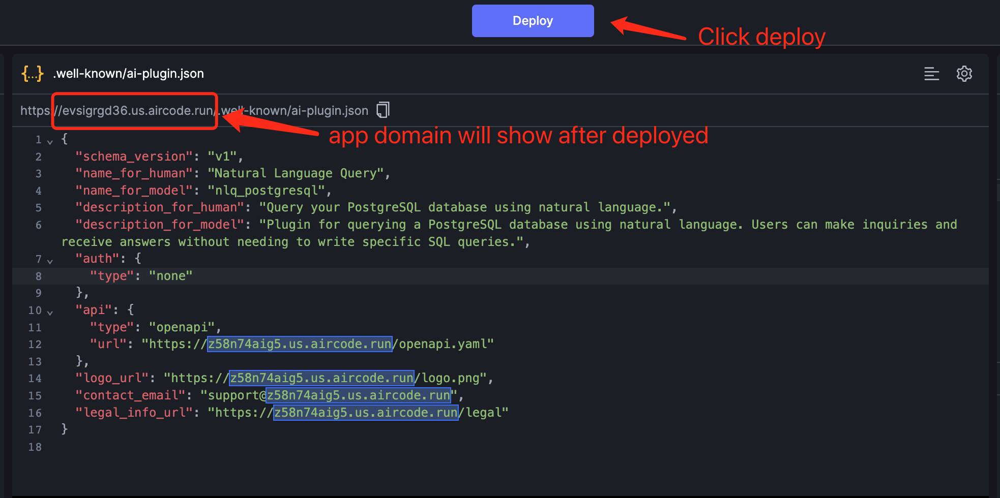
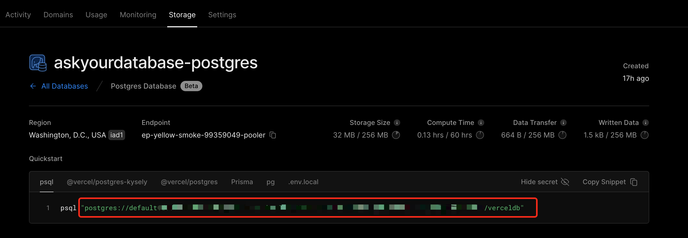

## ChatGPT Plugin for Chatting with PostgreSQL

This plugin is a ChatGPT demo for further development. It only supports PostgreSQL, but you can copy and use it as a starting point for developing your own plugin. 

## Usage

### Fork

As the plugin is developed and deployed on [AirCode](https://aircode.io/), all you need to do is click the following button to get a copy and start developing and deploying your own plugin:

### Update Domain

Once you have successfully copied the plugin, you can deploy it and get your app domain by clicking the "Deploy" button: 

And replace all `rujswe14n3.us.aircode.run` with your own domain in the files `.well-known/ai-plugin.json` and `openai.yaml`, for the case above is `x5a89yqe9z.us.aircode.run`. After you've done that, click deploy again (to update the domain info in your manifest file.)

### Install in ChatGPT 

Click `Develop your own plugin` (If you cannot see this, it indicates that you do not have developer access, you can apply it [here](https://openai.com/waitlist/plugins).):

 

Input the domain of your app and click `Find manifest file`: 

If everything goes well, you will see:

After you installed, you can try it with your PostgreSQL database, if you don't have one, you can try [Vercel Postgres](https://vercel.com/storage/postgres) and get a free postgres DB:

Copy the url of your db, and add a `?sslmode=require` to the end of your database uri, and start chat with your DB in ChatGPT!

