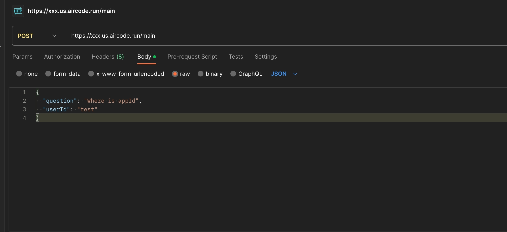

# README

## Introduce

This project helps you to use Langchain to build a knowledge base in your own field

## Usage

### 1. One-Click Deployment

To get a copy and launch your app on [AirCode](https://aircode.io/) by clicking the button below.

### 2. Setup environments

`OPENAPI_API_KEY` And `FIELD` is required, REDIS_URI is optional. If REDIS_URI is set, it will speed up searches for similar questions

### 3. Upload the domain knowledge

Upload the domain knowledge through the upload file feature in the aircode database view. Tips: currently only supports text format

### 4. Implement your app

Modify code to implement your own app and click the `Deploy` button to publish your app online.

### 5. Test your app

Send an http request with the url generated after deployment, and you will get answers from your own knowledge base. Tips: you can use the [Postman](https://www.postman.com/) to test your app.

